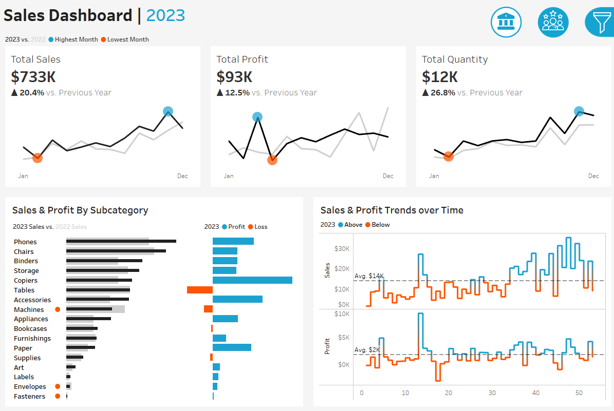

# Sales Dashboard Project

Proyek ini mendemonstrasikan solusi dashboard dengan menggunakan Tableau.

---

## Introduction
Kisah pengguna ini menguraikan spesifikasi untuk membangun dua dashboard menggunakan Tableau untuk membantu para pemangku kepentingan, termasuk manajer penjualan dan eksekutif untuk menganalisis kinerja penjualan dan pelanggan. 

---
## Sales Dashboard | Requirements
### Dashboard Purpose
Tujuan dari sales dasboard adalah untuk menyajikan ikhtisar metrik dan tren penjualan untuk menganalisis kinerja penjualan dari tahun ke tahun dan memahami tren penjualan.

### Key Requirements
#### KPI Overview
Menampilkan ringkasan total penjualan, keuntungan, dan kuantitas untuk tahun berjalan dan tahun sebelumnya.

#### Sales Trends
- Menyajikan data untuk setiap KPI setiap bulan untuk tahun berjalan dan tahun sebelumnya.
- Mengidentifikasi bulan-bulan dengan penjualan tertinggi dan terendah dan buat sedemikian agar mudah dikenali.

#### Product Subcategory Comparison
- Membandingkan kinerja penjualan berdasarkan subkategori produk yang berbeda untuk tahun berjalan dan tahun sebelumnya.
- Sertakan perbandingan penjualan dengan laba.

#### Weekly Trends for Sales & Profit
- Menyajikan data penjualan dan laba mingguan untuk tahun berjalan.
- Menampilkan nilai rata-rata mingguan.
- Menyoroti minggu yang berada di atas dan di bawah rata-rata untuk memusatkan perhatian pada kinerja penjualan & laba.

---
## Customer Dashboard | Requirements
### Dashboard Purpose
Customer dashboard bertujuan untuk memberikan gambaran umum mengenai data, tren, dan perilaku pelanggan. Ini akan membantu tim pemasaran dan manajemen untuk memahami segmen pelanggan dan meningkatkan kepuasan pelanggan.

### Key Requirements
#### Key Overview
Menampilkan ringkasan total jumlah pelanggan, total penjualan per pelanggan, dan total jumlah pesanan untuk tahun berjalan dan tahun sebelumnya.

#### Customer Trends
- Sajikan data untuk setiap KPI setiap bulan untuk tahun berjalan dan tahun sebelumnya.
- Identifikasi bulan-bulan dengan penjualan tertinggi dan terendah dan buat sedemikian agar mudah dikenali.

#### Customer Distribution by Number of Orders
Merepresentasikan distribusi pelanggan berdasarkan jumlah pesanan yang telah mereka lakukan untuk memberikan wawasan tentang perilaku, loyalitas, dan keterlibatan pelanggan.

#### Top 10 Customers By Profit
- Menampilkan 10 pelanggan teratas yang telah menghasilkan keuntungan tertinggi bagi perusahaan.
- Tampilkan informasi tambahan seperti peringkat, jumlah pesanan, penjualan saat ini, keuntungan saat ini, dan tanggal pesanan terakhir.

---
## Design & Interactivity Requirements
### Dashboard Dynamic
- Dasboard harus memungkinkan pengguna untuk memeriksa data historis dengan menawarkan fleksibilitas untuk memilih tahun yang diinginkan.
- Berikan pengguna kemampuan untuk bernavigasi di antara dasboard dengan mudah.
- Buatlah bagan dan grafik yang interaktif, sehingga pengguna dapat menyaring data menggunakan bagan tersebut.

### Data Filters
Memungkinkan pengguna untuk memfilter data berdasarkan informasi produk seperti kategori dan subkategori dan berdasarkan informasi lokasi seperti wilayah, negara bagian, dan kota.